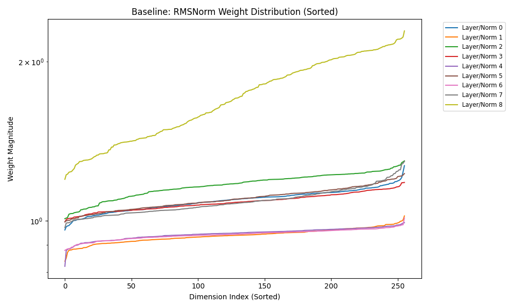
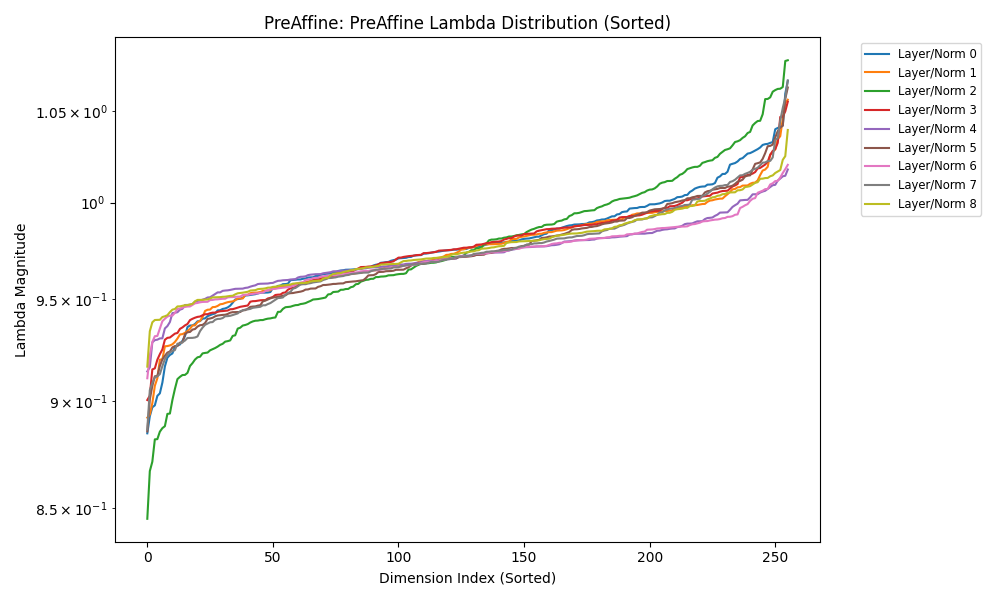
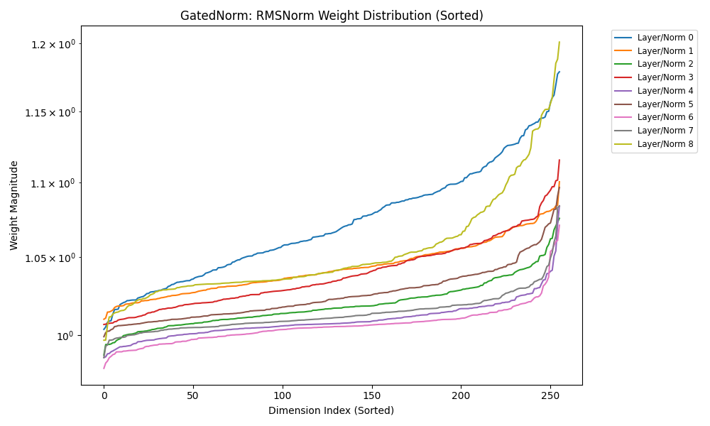

# GatedNorm & PreAffineRMSNorm Implementation

This repository contains a PyTorch implementation of the concepts from the paper **"A Unified View of Attention and Residual Sinks: Outlier-Driven Rescaling is Essential for Transformer Training" (arXiv:2601.22966v1)**.

We implemented and tested:
1.  **PreAffineRMSNorm**: Introduces a learnable scaling vector $\lambda$ before RMSNorm to absorb residual sinks.
2.  **GatedNorm**: Adds a low-rank gating mechanism after normalization for explicit rescaling.

## Experimental Results

We evaluated these methods on a **MiniGPT** model (Decoder-only Transformer, ~13M params) trained on **WikiText-2**.

### Validation Loss (Lower is Better)

| Configuration | Val Loss | Note |
| :--- | :--- | :--- |
| **PreAffine** | **0.0465** | Best performance (Slightly improved over baseline). |
| **Baseline** (RMSNorm) | 0.0472 | Strong baseline. |
| **GatedNorm** | 0.0496 | Comparable, slightly higher loss. |

### Weight Analysis
Our analysis confirmed the paper's hypothesis regarding "Outlier-Driven Rescaling":

-   **Baseline**: RMSNorm weights show sharp dips near zero, indicating they are actively suppressing massive residual sinks.
    

-   **PreAffine**: The learnable $\lambda$ vector shows large spikes, indicating it successfully absorbs the sinks, allowing subsequent RMSNorm weights to be more uniform.
    

-   **GatedNorm**: The gating mechanism provides explicit control over the residual stream. While effective, our results show slightly higher loss compared to PreAffine, suggesting that the simpler PreAffine scaling might be sufficient or easier to optimize for this scale.
    

## Usage

### Requirements
-   Python 3.10+
-   PyTorch
-   `uv` (recommended)

### Installation
```bash
git clone https://github.com/daichi202/gated-norm-experiment.git
cd gated-norm-experiment
uv sync
```

### Running Experiments
You can run training and evaluation using `experiment.py`.

```bash
# Run all configurations
uv run experiment.py --config_name all --epochs 1 --batch_size 32

# Run a specific configuration
uv run experiment.py --config_name PreAffine

# Push trained weights to Hugging Face Hub
uv run experiment.py --push_to_hub --hf_repo_id "your-username/repo-name"
```

### Evaluation from HF Hub
To download trained models from Hugging Face Hub and analyze them:

```bash
uv run evaluate.py --repo_id "daichi202/gated-norm-test"
```
